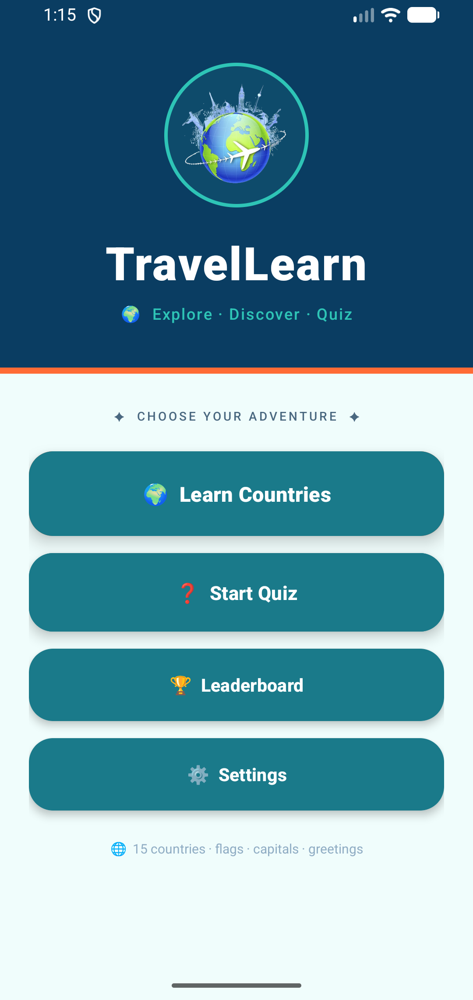
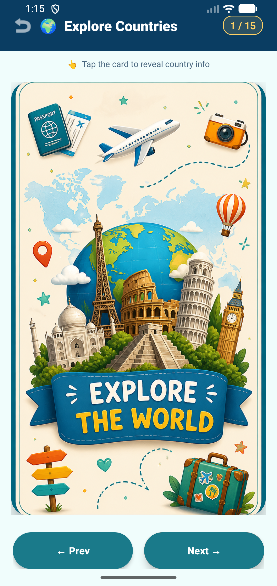
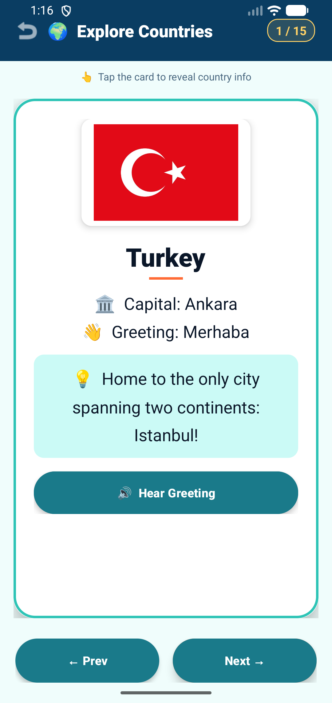
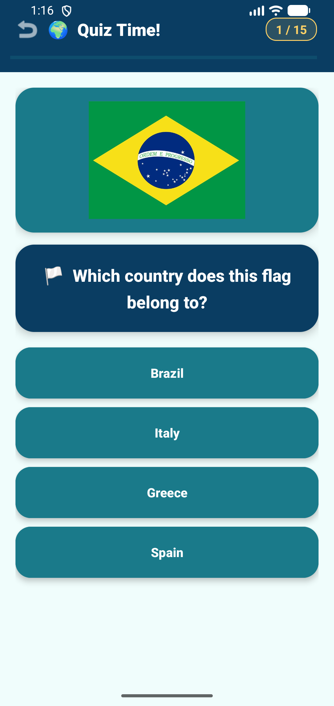
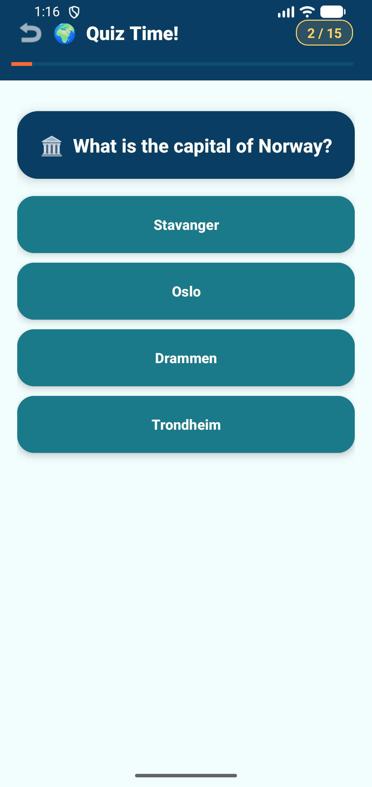

# TravelLearn

An Android application that teaches world geography through interactive flashcards and quizzes.

## About

TravelLearn helps students learn about countries, capitals, flags, greetings, and cultural facts through a simple and engaging mobile experience.

Built as part of a university Mobile Development course using Java and Android Studio.

## Features

* Interactive flashcards for 15 countries
* Text-to-Speech pronunciation of greetings
* Geography quiz with 15 questions
* Instant answer feedback
* Leaderboard with score tracking
* Confetti animation for successful quiz results
* Share quiz results with other apps
* User settings and sound preferences

## Technologies Used

* Java
* Android Studio
* Android SDK
* Material Design 3
* SharedPreferences
* Text-to-Speech API

## Screenshots

## 📸 Screenshots

### Home Screen

### Flashcards

| Card 1 | Card 2 |
|---------|---------|
|  |  |

### Quiz

| Question 1 | Question 2 |
|------------|------------|
|  |  |

### Results & Leaderboard

| Results | Leaderboard |
|----------|------------|
|  |  |

## Getting Started

1. Clone the repository.
2. Open the project in Android Studio.
3. Allow Gradle to sync.
4. Run on an emulator or Android device.

## Author

**Aida Zace**
